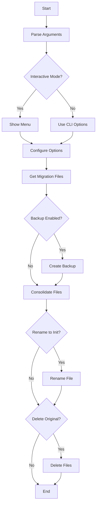

# Supabase Migrations Consolidator

A powerful Python tool designed to consolidate Supabase SQL migrations into a single file, with advanced backup and management capabilities.

## 🔄 Workflow Diagram



## 🌟 Features

- **Migration Consolidation**: Combines multiple SQL migration files into a single, organized file
- **Interactive Menu**: User-friendly interface for configuration options
- **Backup System**: Automatic timestamped backups of original migrations
- **Safe Deletion**: Optional removal of original migrations after backup
- **Init Migration**: Option to rename consolidated file as an initialization migration
- **Rich CLI Interface**: Enhanced terminal output with progress bars and colored text (when Rich library is available)

## 📋 Requirements

- Python 3.x
- Optional: Rich library for enhanced UI (`pip install rich`)
- Operating System: Cross-platform compatible (Windows, macOS, Linux)

## 🚀 Installation

1. Download the script:
   ```bash
   curl -O https://raw.githubusercontent.com/Eplisium/supabase_migrations_consolidator/main/consolidate_migrations.py
   ```

2. Make it executable (Unix-based systems):
   ```bash
   chmod +x consolidate_migrations.py
   ```

3. Install optional dependencies for enhanced UI:
   ```bash
   pip install rich
   ```

## 💻 Usage

### Interactive Mode

Run the script without arguments to use the interactive menu:
```bash
python consolidate_migrations.py
```

### Command Line Arguments

```bash
python consolidate_migrations.py [-h] [-b] [-d] [-r] [-t TIMESTAMP] [-i]

options:
  -h, --help            Show help message
  -b, --backup         Backup original migrations
  -d, --delete         Delete original migrations after backup
  -r, --rename         Rename consolidated file to init migration
  -t TIMESTAMP         Custom timestamp for init migration
  -i, --interactive    Use interactive menu
```

### Example Commands

1. Basic consolidation with backup:
   ```bash
   python consolidate_migrations.py -b
   ```

2. Consolidate, backup, and rename to init:
   ```bash
   python consolidate_migrations.py -b -r
   ```

3. Full process with custom timestamp:
   ```bash
   python consolidate_migrations.py -b -d -r -t 20230501
   ```

## ⚙️ Configuration Options

### Backup Settings
- Creates timestamped backups in a `backups` directory
- Maintains original file structure
- Automatic backup of existing consolidated files

### Deletion Options
- Safe deletion with mandatory backup
- Interactive confirmation required
- Prevents accidental data loss

### Renaming Options
- Custom timestamp support
- Automatic backup of existing init files
- Consistent naming convention

## 📁 File Structure

```
your-project/
├── consolidate_migrations.py
├── migrations/
│   ├── original_migration_1.sql
│   ├── original_migration_2.sql
│   └── ...
├── consolidated_migration.sql
└── backups/
    └── migrations_backup_YYYYMMDD_HHMMSS/
        ├── original_migration_1.sql
        ├── original_migration_2.sql
        └── ...
```

## 🔧 How It Works

1. **File Discovery**
   - Scans the current directory for SQL migration files
   - Excludes consolidated and init migrations
   - Sorts files by timestamp/name

2. **Backup Process**
   - Creates timestamped backup directory
   - Preserves original file attributes
   - Maintains file hierarchy

3. **Consolidation Process**
   - Creates temporary file for safety
   - Adds descriptive headers
   - Maintains original file separation
   - Ensures proper formatting

4. **Safety Measures**
   - Mandatory backup before deletion
   - Temporary file usage
   - Interactive confirmations
   - Existing file preservation

## 🤝 Contributing

1. Fork the repository
2. Create a feature branch
3. Commit your changes
4. Push to the branch
5. Create a Pull Request

### Development Guidelines

- Follow PEP 8 style guide
- Add descriptive comments
- Update documentation
- Include tests for new features
- Maintain cross-platform compatibility

## 📄 License

This project is licensed under the MIT License - see the LICENSE file for details.

## 🙏 Acknowledgments

- Supabase community
- Rich library developers
- All contributors

## 📞 Support

For issues and feature requests, please use the GitHub issue tracker.